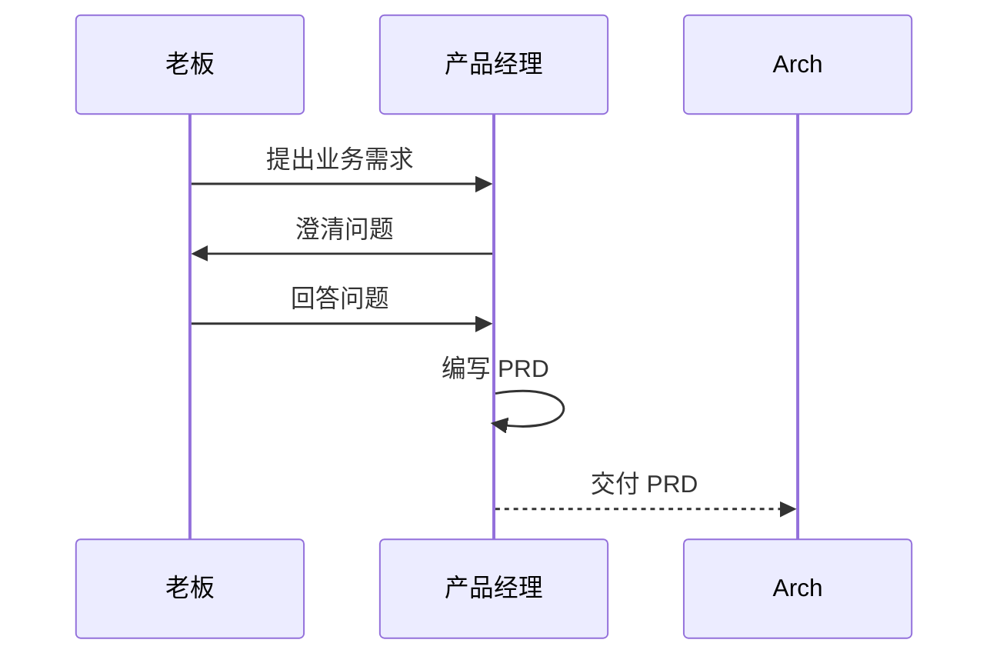
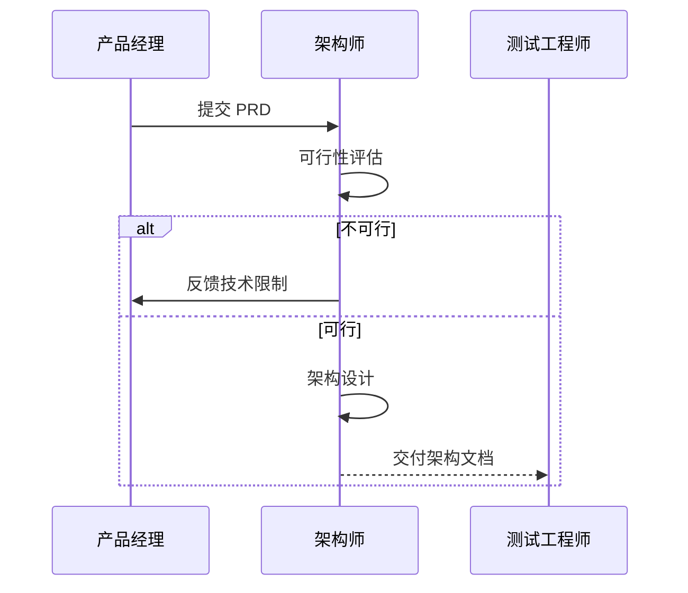
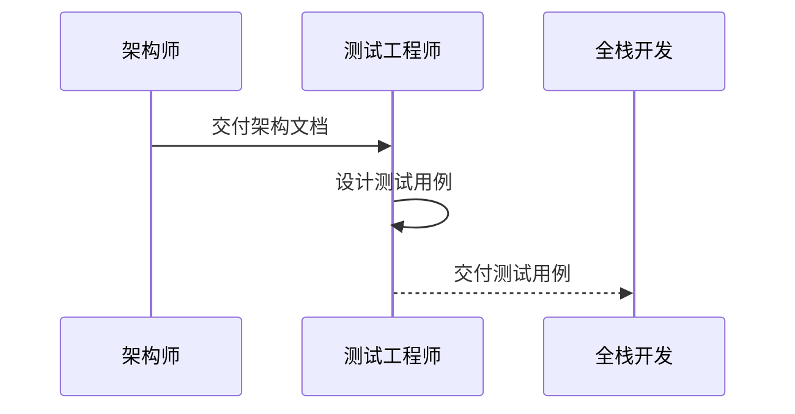
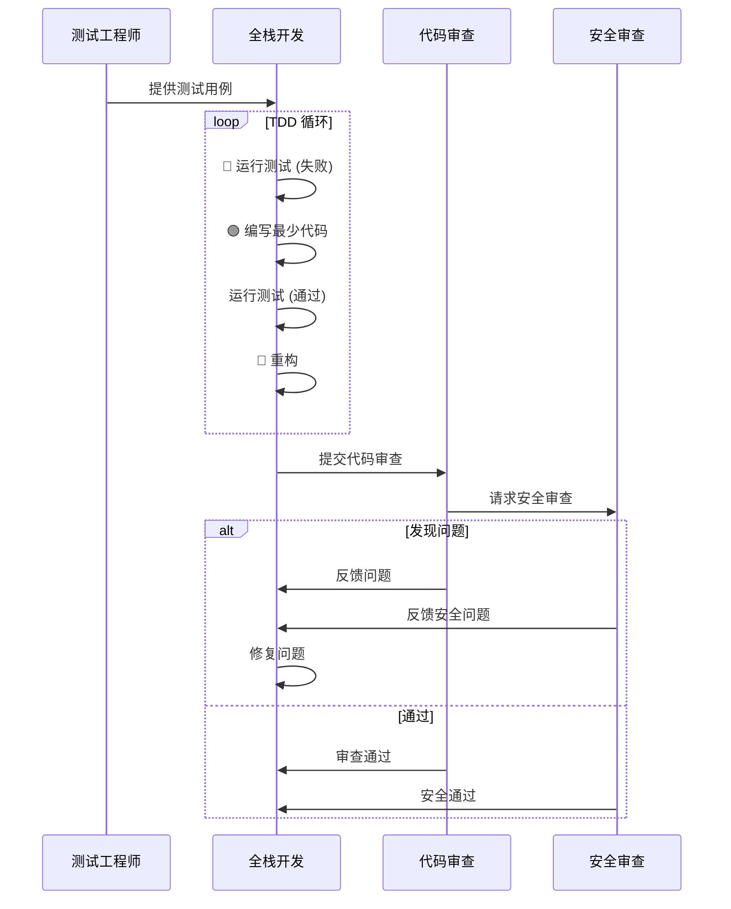
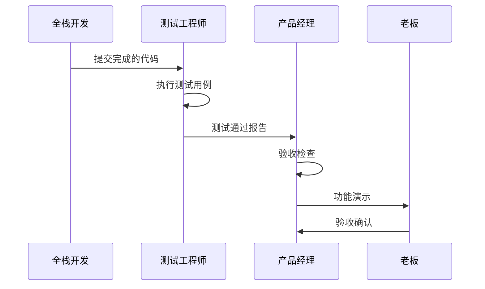

# AI 协作 TDD 工作流指南

本文档描述了 Spanios Wiki 项目中 AI 智能体协作的完整工作流程，采用 TDD（测试驱动开发）方法论。

## 工作流概览

```
┌─────────────────────────────────────────────────────────────────────────────┐
│                            AI 协作 TDD 工作流                                │
└─────────────────────────────────────────────────────────────────────────────┘

     ┌──────────┐
     │   老板   │  业务需求
     └────┬─────┘
          │
          ▼
┌──────────────────┐
│   产品经理 (PM)   │  ──────────────────────────────────────────┐
│                  │  PRD + 用户故事 + 验收标准                    │
└────────┬─────────┘                                              │
         │                                                        │
         ▼                                                        │
┌──────────────────┐     需求不清晰？                              │
│   架构师 (Arch)   │  ◄──────────────────────────────────────────┘
│                  │  可行性评估 + 架构设计
└────────┬─────────┘
         │
         ▼
┌──────────────────┐
│ 测试工程师 (QA)   │  测试计划 + 测试用例
└────────┬─────────┘
         │
         ▼
┌──────────────────┐     ┌──────────────────┐     ┌──────────────────┐
│ 全栈开发 (Dev)    │ ──▶│ 代码审查员 (CR)   │ ──▶│ 安全审查员 (SR)   │
│                  │     │                  │     │                  │
│ TDD 循环:        │     │ 代码质量检查      │     │ 安全漏洞扫描      │
│ Red→Green→Refactor│     └────────┬─────────┘     └────────┬─────────┘
└────────┬─────────┘              │                        │
         │                        │ 问题修复                │ 问题修复
         │ ◄──────────────────────┴────────────────────────┘
         │
         ▼
┌──────────────────┐
│   产品经理 (PM)   │  产品验收
└──────────────────┘
         │
         ▼
    ✅ 功能完成
```

## 智能体角色说明

| 角色 | 文件 | 核心职责 | 输入 | 输出 |
|------|------|----------|------|------|
| 产品经理 | `product-manager.agent.md` | 需求澄清、PRD 编写 | 业务需求 | PRD 文档 |
| 架构师 | `architect.agent.md` | 可行性评估、架构设计 | PRD | 架构设计文档 |
| 测试工程师 | `qa-engineer.agent.md` | 测试用例设计 | PRD + 架构 | 测试用例 |
| 全栈开发 | `full-stack-dev.agent.md` | TDD 实现 | 测试用例 + 架构 | 代码实现 |
| 代码审查员 | `code-reviewer.agent.md` | 代码质量审查 | 代码实现 | 审查报告 |
| 安全审查员 | `security-reviewer.agent.md` | 安全漏洞审查 | 代码实现 | 安全报告 |

## 标准工作流程

### Phase 1: 需求定义



**产品经理工作要点**：
1. 不假设需求，先问清楚
2. 使用可衡量的指标
3. 编写清晰的验收标准

**交付物**：
- PRD 文档（包含用户故事、验收标准）

### Phase 2: 架构设计



**架构师工作要点**：
1. 评估技术可行性
2. 识别风险和依赖
3. 设计可测试的架构

**交付物**：
- 可行性评估报告
- 技术架构设计文档

### Phase 3: 测试设计



**测试工程师工作要点**：
1. 覆盖所有用户故事
2. 包含边界条件和错误场景
3. 测试用例可直接转换为代码

**交付物**：
- 测试计划
- 详细测试用例

### Phase 4: TDD 开发



**全栈开发工作要点**：
1. 严格遵循 TDD 循环
2. 每次只写通过测试的最少代码
3. 重构时确保测试仍然通过

### Phase 5: 验收



## 智能体交接机制

每个智能体都配置了 `handoffs` 字段，支持快速交接：

```yaml
handoffs:
  - label: 🏗️ 请求架构评审
    agent: architect
    prompt: '请对上述 PRD 进行技术可行性评估和架构设计。'
    send: false
```

### 交接矩阵

| 从 \ 到 | PM | Arch | QA | Dev | CR | SR |
|---------|:--:|:----:|:--:|:---:|:--:|:--:|
| PM      | -  | ✅   | ⚪ | ✅  | ⚪ | ⚪ |
| Arch    | ✅ | -    | ✅ | ✅  | ⚪ | ⚪ |
| QA      | ✅ | ⚪   | -  | ✅  | ⚪ | ⚪ |
| Dev     | ✅ | ⚪   | ✅ | -   | ✅ | ✅ |
| CR      | ⚪ | ⚪   | ⚪ | ✅  | -  | ✅ |
| SR      | ⚪ | ⚪   | ⚪ | ✅  | ✅ | -  |

✅ = 标准交接路径 | ⚪ = 可选/升级路径

## 工作流变体

### 简化流程（小功能）

对于简单的 bug 修复或小功能，可以简化流程：

```
老板 → 产品经理 → 全栈开发（含架构） → 代码审查 → 产品验收
```

### 紧急修复流程

```
Bug 报告 → 全栈开发 → 代码审查 → 安全审查（如涉及） → 部署
```

## 最佳实践

### 1. 沟通规范

- 每个阶段交付时使用明确的交接声明
- 问题反馈要具体、可操作
- 保持文档更新

### 2. 质量门禁

| 阶段 | 质量门禁 |
|------|----------|
| PRD | 验收标准可测试、指标可衡量 |
| 架构 | 技术可行、符合现有模式 |
| 测试 | 覆盖所有用户故事 |
| 代码 | 测试通过、lint 通过 |
| 审查 | 无 Critical/Major 问题 |

### 3. 文档规范

所有产出物应保存到项目文档目录：

```
docs/
├── product/           # PRD 文档
│   └── [feature]-prd.md
├── architecture/      # 架构设计
│   └── [feature]-design.md
├── test-plans/        # 测试计划
│   └── [feature]-tests.md
└── reviews/           # 审查报告
    └── [date]-[feature]-review.md
```

## 快速开始

1. **启动新功能**：使用 `@product-manager` 开始需求讨论
2. **架构评审**：使用 `@architect` 进行技术评估
3. **设计测试**：使用 `@qa-engineer` 设计测试用例
4. **TDD 开发**：使用 `@full-stack-dev` 开始编码
5. **代码审查**：使用 `@code-reviewer` 审查代码
6. **安全审查**：使用 `@security-reviewer` 检查安全

## 相关文件

- [产品经理](./product-manager.agent.md)
- [架构师](./architect.agent.md)
- [测试工程师](./qa-engineer.agent.md)
- [全栈开发](./full-stack-dev.agent.md)
- [代码审查员](./code-reviewer.agent.md)
- [安全审查员](./security-reviewer.agent.md)
